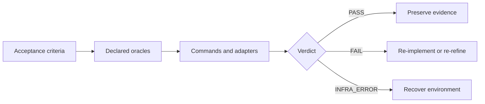

# @proofofwork-agency/dogfood

**Your tests passed. Which claim did that prove?**

An agent finishes a task and reports green. The suite exited `0`, so CI is satisfied. But a
`--grep` that matched nothing also exits `0`. A test that failed and passed on retry exits `0`. A
suite with the one relevant assertion commented out exits `0`. An exit code cannot tell you which
acceptance criterion it proved, because it was never asked.

Dogfood asks. You declare each acceptance criterion and bind it to an **exact** oracle — one named
Playwright test tag, or one named command. It runs them under watch and emits a checksummed,
signable bundle that anyone can re-verify offline, without trusting the machine that produced it.



## What it refuses

A gate is defined by what it will not let through.

| Refusal | Why it matters |
|---|---|
| A tag or command that matches **nothing** fails | The most common false green in agent-written CI. `--grep @missing` exits 0 and proves nothing. |
| A criterion with **no oracle** fails | Never a silent skip. If you did not say how it would be proven, it is not proven. |
| A test that passed **on retry** fails | The first attempt must pass. Retries launder flakes into evidence. |
| A **weakened contract** fails | Against a base commit, removing a criterion, downgrading its class, or trading a tagged test for an exit code is refused before anything runs. |
| A command whose **net tracked Git state changes** during its proof fails | Git state is captured before and after every command. An edit reverted byte-for-byte before the final snapshot is outside this guarantee. |
| The **generated contract** fails | `dogfood init` scaffolds something that cannot pass until you map a real oracle. A scaffold that passes immediately proves nothing. |

## What PASS does not mean

This is the part most tools in this space leave out, so it is stated here, in the CLI output, and
inside the bundle itself.

- **It does not mean the software is correct.** It means the criteria you declared were proven by
  the oracles you declared. A requirement you never wrote down is not covered.
- **Bare verification is not provenance.** Checksums prove a bundle is internally consistent. Only
  `dogfood verify --key <public key you obtained independently>` says who produced it — a key read
  out of the bundle is not a trust anchor, because whoever regenerates the manifest can regenerate
  the key.
- **A contract is executable code you are trusting.** Running one runs its shell commands. There is
  no sandbox. Review a contract the way you would review a script.
- **Mutation detection cannot see Git-ignored files.** They are outside the boundary, and the report
  says so.

All deterministic criteria block regardless of `severity`. Warnings never change the verdict.

## Works with any agent

Dogfood is a CLI. It reads a contract, runs commands, and exits with a status code. There is no
plugin API, no daemon, and no SDK — the only harness-specific line in the entire runtime is the one
in `dogfood init` that decides where to copy a Markdown file.

| Harness | Integration | Shipped for it |
|---|---|---|
| **Claude Code** | Runs the CLI; `init` installs a skill at `.claude/skills/dogfood/SKILL.md` | A skill file |
| **Codex** | Runs the CLI; `init` installs the same skill at `.agents/skills/dogfood/SKILL.md` | A skill file |
| **Cursor, Aider, Copilot, Devin, others** | Run the CLI; point the agent at the vendor-neutral skill file or paste it into your rules | Nothing needed |
| **Plain CI** | Run the CLI, gate on the exit code | A composite Action and a workflow template |
| **A human** | Run the CLI | — |

The two skill files are byte-identical copies of one template. `.claude/skills/` is Claude Code's
convention; `.agents/skills/` is the vendor-neutral one. If your tool reads neither, it is still
plain Markdown.

A human, a CI job, Claude Code, and Codex run the same binary against the same contract and get the
same verdict. There is no plugin API on purpose: **a gate an agent can configure is a gate the agent
can weaken.** The integration surface is exit codes, `--json`, and pointer files — see
[agent operation](docs/agents.md).

## Why it is small

Three runtime dependencies: `ajv`, `ajv-formats`, `yaml`. Signing uses `node:crypto` and adds
nothing. Verification is offline — no daemon, no network, no service. The tool you use to check the
evidence should not be larger than the thing it is checking.

## Install

```bash
npm install --save-dev @proofofwork-agency/dogfood
npx dogfood version
```

Pinning a reviewed Git revision also works, and is what you want if you need a commit that is not yet released:

```bash
npm install --save-dev github:proofofwork-agency/dogfood#<full-commit-sha>
```

For work on dogfood itself, run `npm ci` in this checkout and invoke `node bin/dogfood.mjs`.

## Five-minute setup

Initialize from the project you want to verify:

```bash
npx dogfood init
```

The starter contract intentionally cannot pass until you replace its placeholder. A minimal complete contract looks like this:

```yaml
version: 1
project: my-service

build:
  requireIdentity: true

commands:
  test:
    run: npm test
    timeoutMs: 120000
    adapter: exit-code

gates:
  verification: [test]

oracles:
  test-suite:
    kind: command
    command: test

acceptanceCriteria:
  - id: AC-tests
    text: The complete automated test suite passes.
    class: deterministic
    oracle: test-suite
    severity: blocker
```

Validate, run, inspect, and verify the resulting bundle:

```bash
npx dogfood validate
npx dogfood run
npx dogfood report
npx dogfood verify artifacts/dogfood/<run-id>
```

`validate` checks schema and mappings without executing proof commands. `run` executes a fresh proof. `report` prints the summary referenced by `artifacts/dogfood/latest.json`. `verify` rechecks a chosen bundle offline.

## Evidence model

| Oracle | Adapter | What it proves |
|---|---|---|
| `kind: command` | `exit-code` | The complete named shell command exited with code 0. |
| `kind: playwright` | `playwright-json` | Every execution with the exact `@dogfood:<criterion-id>` tag passed on its first attempt. |
| `kind: junit` | `junit-xml` | The named `<testcase>` exists in the report, has no `<failure>` or `<error>`, and was not skipped. |
| `kind: advisory` | none | A review receipt was recorded; it never changes the hard verdict. |

Use a Playwright or JUnit oracle when the claim requires proof that one specific test existed and ran. A broad command exiting 0 cannot prove that a grep or tag matched anything — `pytest -k "no_such_test"` matches nothing and exits 0.

The JUnit adapter reads any runner that emits JUnit XML: pytest, Vitest, Jest, Go via gotestsum, Maven, Gradle, RSpec, PHPUnit. See [docs/junit.md](docs/junit.md).

## Authoritative policy

`npx dogfood init --authoritative` also writes `.dogfood/dogfood.policy.yaml`. Pass it explicitly:

```bash
npx dogfood validate --policy .dogfood/dogfood.policy.yaml
npx dogfood run --policy .dogfood/dogfood.policy.yaml
```

Policies are never auto-discovered because silently enabling one could flip verdicts. When the default policy file exists but `--policy` is omitted, the run stays in the standard profile and records a warning.

The authoritative profile can require a criteria floor and named gates, block contract regression against `--baseline-ref`, inspect the whole Git root for tracked and non-ignored untracked changes, require a build subject, and control log redaction.

## CLI

| Command | Purpose |
|---|---|
| `dogfood init` | Install a starter contract, optional policy, CI template, and agent skills. |
| `dogfood validate` | Validate the contract, policy, baseline, and mappings without executing proof commands. |
| `dogfood run` | Execute a fresh proof and write an evidence bundle. |
| `dogfood verify` | Check a bundle's manifest, checksums, snapshots, and declared subject. |
| `dogfood report` | Print the latest executed-run summary. |
| `dogfood version` | Print the package version. |
| `dogfood help` | Print usage and exit codes. |

See the [complete CLI reference](docs/cli.md) for flags, discovery rules, environment variables, and exit codes.

## Documentation

Full reference: **https://proofofwork-agency.github.io/dogfood/**

- [Contract reference](docs/contract.md)
- [Authoritative policy](docs/policy.md)
- [Artifact bundles and verification](docs/artifacts.md)
- [Signing and provenance](docs/signing.md)
- [Playwright evidence](docs/playwright.md)
- [JUnit XML evidence](docs/junit.md)
- [Advisory receipts](docs/advisory.md)
- [Continuous integration](docs/ci.md)
- [Agent operation](docs/agents.md)
- [Runnable examples](docs/examples.md)
- [Licensing](docs/licensing.md)

The contract is trusted executable code. Running a contract runs its shell commands without a sandbox. Review contracts and policies before execution.

## Development

```bash
npm test
npm run test:self
npm run test:playwright-fixture
```

The repository gates itself with `.dogfood/dogfood.contract.yaml`. See [CONTRIBUTING.md](CONTRIBUTING.md) for the full contributor workflow once that release document is present.

Licensed under Apache-2.0.
