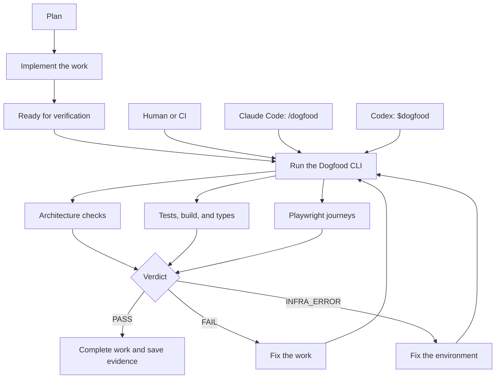

# @proofofwork-agency/dogfood

Dogfood is a final verification checkpoint that you add after implementation:



Claude Code invokes `/dogfood`; Codex invokes `$dogfood`. Both validate the contract, run the same independent Dogfood CLI, read the generated report, and return the same PASS, FAIL, or INFRA_ERROR verdict to the workflow.

You configure the checks that matter to your project: architecture rules, unit or integration tests, builds, type checks, security checks, and exact Playwright user journeys. Dogfood runs those checks, connects their results to your acceptance criteria, and blocks the workflow when the required proof is missing or failing. It also produces a report showing exactly what passed and failed.

Dogfood does not invent your architecture rules or automatically decide what “correct architecture” means. You provide the architecture command—for example dependency-boundary tests, lint rules, or a custom architecture script—and Dogfood makes that command a required, recorded part of completion.

You can run Dogfood manually, from CI, at the end of an implementation workflow, or through Claude Code or Codex. All four use the same independent CLI and receive the same verdict.

## What Dogfood does

Dogfood sits above the verification tools a project already has. It does not replace unit tests, architecture checks, build scripts, or Playwright; it runs them under an explicit proof contract and records what they actually establish.

The core contract concepts are:

| Concept | Purpose |
|---|---|
| `commands` | Trusted shell commands that perform verification. |
| `gates` | Explicit must-run command groups. A gated command can fail the project even when it is not mapped to one acceptance criterion. |
| `oracles` | The evidence source for an acceptance criterion: a complete command, an exact Playwright tag, or an advisory review. |
| `acceptanceCriteria` | The claims being evaluated and the oracle assigned to each claim. |
| adapters | The code that interprets command evidence. V2 includes `exit-code` and `playwright-json`. |

The proof flow is:

```text
acceptance criteria -> declared oracles -> commands -> evidence adapters
                                                        |
                                                        v
                                    AC matrix + PASS/FAIL + artifact bundle
```

When you run `dogfood run`, Dogfood:

1. Loads and validates `.dogfood/dogfood.contract.yaml`. Missing or broken oracle mappings fail before proof execution.
2. Captures the Git commit and initial tracked repository state.
3. Runs each required command once, with its configured timeout and without automatic retries or repair.
4. Evaluates the evidence. An `exit-code` adapter proves only that the complete named command passed. A `playwright-json` adapter proves the exact configured `@dogfood:AC-ID` tests ran and passed on their first attempt.
5. Compares tracked repository state before and after verification. A command that changes tracked files fails the run.
6. Scores every acceptance criterion and classifies the overall result as `PASS`, `FAIL`, or `INFRA_ERROR`.
7. Writes a portable evidence bundle containing the contract snapshot, command logs, adapter evidence, AC matrix, JUnit, checksums, environment metadata, and human-readable summary.

Dogfood is not a test framework, code generator, or repair agent. It orchestrates evidence produced by tools you already use and never edits product code to make a run pass. It also does not require Claude, Codex, ContextRelay, or any other agent: a human, CI job, Claude, or Codex all run the same CLI. Agent or human browser reviews can be attached as advisory receipts, but they never replace deterministic proof or change the hard verdict.

### What a PASS means

A `PASS` means the contract was valid, every required project command passed, every deterministic acceptance criterion received its configured evidence, required exact Playwright tags passed without retry, the required build identity was available, and no tracked mutation was detected inside the configured workspace.

A `PASS` does **not** mean that:

- Dogfood proved requirements that were never declared in the contract;
- a judgmental usability or design review was satisfied;
- untracked cache or screenshot files were absent;
- tracked files outside the configured `--cwd` scope were unchanged; or
- `minor` deterministic criteria were ignored. All deterministic severities block in v2.

## Quick start

### 1. Install an exact revision

The package is intentionally private and unpublished on npm while v0.3 is validated. Install an exact public Git revision:

```bash
npm install --save-dev github:proofofwork-agency/dogfood#<full-commit-sha>
npx dogfood version
```

For local development, `npm install --save-dev /absolute/path/to/dogfood` also works. `private: true` prevents accidental npm publication; it does not prevent local-path or Git dependency installation.

### 2. Initialize the project

Run this from the Git repository or package directory you want Dogfood to verify:

```bash
npx dogfood init
```

Use `npx dogfood init --authoritative` for a protected CI setup. It also creates the explicit `.dogfood/dogfood.policy.yaml`; without `--policy`, Dogfood intentionally retains the standard compatibility behavior.

Initialization creates:

```text
.dogfood/dogfood.contract.yaml               # intentionally incomplete proof contract
.dogfood/README.md                            # local setup reminder
.dogfood/gitignore.fragment                   # artifact ignore rule to merge
.dogfood/github-workflow.dogfood.yml          # optional GitHub Actions example
.claude/skills/dogfood/SKILL.md               # Claude Code project skill
.agents/skills/dogfood/SKILL.md               # Codex project skill
artifacts/dogfood/                             # evidence output root
```

The generated contract is intentionally unable to pass. This prevents a newly initialized project from reporting success before its real commands and acceptance criteria have been mapped. Existing agent skill files are preserved unless you explicitly use `--force`.

Merge the contents of `.dogfood/gitignore.fragment` into the project's `.gitignore` so generated evidence does not pollute normal commits.

### 3. Map the real proof

Edit `.dogfood/dogfood.contract.yaml` and replace the placeholder with the project's actual verification commands. For every in-scope deterministic criterion:

1. Give the criterion a stable ID such as `AC-checkout`.
2. Declare the command that produces its evidence.
3. Select `exit-code` for a complete generic command or `playwright-json` for exact browser-test evidence.
4. Declare an oracle that references the command.
5. Point the acceptance criterion at that oracle.
6. For Playwright, tag the test with the exact corresponding tag, for example `@dogfood:AC-checkout`.

Do not map a broad browser command through `exit-code` when the claim requires proof of one specific user journey. A successful Playwright process is not proof that the expected tagged test existed or ran.

#### Example A: functional acceptance criterion

A functional criterion describes **what a user must be able to do**.

> AC: A customer can complete checkout and see the confirmation page.

The project supplies a real Playwright test carrying the exact Dogfood tag:

```js
import { expect, test } from "@playwright/test";

test("customer completes checkout", {
  tag: "@dogfood:AC-functional-checkout",
}, async ({ page }) => {
  await page.goto("/checkout");
  await page.getByRole("button", { name: "Pay now" }).click();
  await expect(page.getByRole("heading", { name: "Order confirmed" })).toBeVisible();
});
```

The contract maps that user-facing claim to the tagged evidence:

```yaml
commands:
  browser:
    run: npx playwright test --reporter=json
    timeoutMs: 600000
    adapter: playwright-json

oracles:
  checkout-completes:
    kind: playwright
    command: browser
    tag: "@dogfood:AC-functional-checkout"

acceptanceCriteria:
  - id: AC-functional-checkout
    issue: SHOP-142
    class: deterministic
    oracle: checkout-completes
    severity: blocker
```

Dogfood does not accept “the browser suite exited successfully” as proof. The JSON report must contain that exact tag, and every matching execution must have passed on its first attempt.

#### Example B: system or architecture criterion

A system criterion describes **how the system must be technically structured**.

> AC: UI code must not import database or server-only modules.

The project owns the actual rule and its implementation. For example, `npm run test:architecture` could invoke dependency-cruiser, ESLint boundaries, ArchUnit, a contract test, or a custom script. Dogfood makes the complete command mandatory:

```yaml
commands:
  architecture:
    run: npm run test:architecture
    timeoutMs: 120000
    adapter: exit-code

oracles:
  architecture-boundaries:
    kind: command
    command: architecture

acceptanceCriteria:
  - id: AC-system-boundaries
    issue: SHOP-142
    class: deterministic
    oracle: architecture-boundaries
    severity: major
```

Dogfood does not invent or understand the boundary rule. The architecture tool owns that logic; Dogfood proves the declared command ran successfully, ties it to the system criterion, and records the result.

#### Putting both types in one gate

Most projects should include both types in the same contract:

```text
Functional AC -> exact Playwright tag -------┐
                                             ├-> Dogfood -> one hard verdict
System AC ----> architecture command --------┘
```

If either deterministic criterion fails, the overall result is `FAIL`. If an important functional or system criterion is absent from the contract, Dogfood cannot prove it.

### 4. Validate, run, and read the report

```bash
npx dogfood validate
npx dogfood run
npx dogfood report
```

`validate` checks schema and mappings only. It reports deterministic criteria as not run and never pretends the commands executed. `run` executes the complete proof and returns a process exit code suitable for CI. `report` prints the latest Markdown summary.

The machine-readable pointer is `artifacts/dogfood/latest.json`; it points to the latest run directory using relative paths.

## Use Dogfood with Claude Code and Codex

Claude and Codex are **operators of the same independent CLI**, not alternative evidence engines. The generated skills teach each agent when to validate, when to run, where to read the result, and what it must not do during verification.

The skills are optional convenience and policy layers:

- Dogfood still works if neither agent is installed.
- Claude and Codex execute the same `dogfood` binary and receive the same verdict.
- The skills do not grant a PASS, weaken a criterion, retry flaky evidence, or repair code during a proof run.
- After `dogfood init`, start a new agent session if the newly created skill does not appear immediately.

### Claude Code

Dogfood installs a project skill at `.claude/skills/dogfood/SKILL.md`. Claude Code discovers project skills from `.claude/skills`; the directory name makes this skill available as `/dogfood`. See the official [Claude Code skills documentation](https://code.claude.com/docs/en/slash-commands).

Start Claude Code from the project repository, then invoke the skill explicitly:

```text
/dogfood Run the deterministic acceptance gate for the current implementation. Do not repair anything during the run. Report the verdict, failing ACs, and evidence path.
```

You can also ask naturally because the skill description allows automatic matching:

```text
Run Dogfood before we call this work complete. If the contract is invalid, stop and explain the missing mappings. If it runs, summarize the acceptance matrix and link the report.
```

### Codex

Dogfood installs the equivalent project skill at `.agents/skills/dogfood/SKILL.md`. Codex discovers repository skills from `.agents/skills` and supports explicit `$skill-name` invocation. See the official [Codex skills documentation](https://learn.chatgpt.com/docs/build-skills).

Start Codex from the project repository, then invoke:

```text
$dogfood Run the deterministic acceptance gate for the current implementation. Do not change product code or tests during verification. Report the verdict, failing ACs, and evidence path.
```

The same workflow can be requested in plain language:

```text
Use the Dogfood evidence gate now. Validate first, run only when mappings are valid, then read artifacts/dogfood/latest.json and summarize what was actually proved.
```

### What the agent should do with each result

Whether Claude or Codex runs the gate, the expected workflow is the same:

| Result | Agent behavior |
|---|---|
| Contract validation failure | Stop. Report the invalid or missing mapping. Do not claim tests ran. |
| `PASS` | Report the deterministic AC matrix and preserve/link the evidence directory for the candidate commit. |
| `FAIL` | Report the failed commands and criteria. Fix the product or refine an incorrect criterion in a separate workflow, then start a fresh complete Dogfood run. |
| `INFRA_ERROR` | Recover the environment without changing the proof contract, then start a fresh complete run. |

The no-repair rule applies **during** the proof run. After a `FAIL`, an agent may use the report to implement a fix in a separate step; it must then rerun the whole gate rather than reusing partial evidence.

### Advisory browser reviews from an agent

Claude, Codex, another browser agent, or a human may perform a qualitative review and write an advisory receipt. Dogfood does not launch that review automatically. The reviewer must save the receipt and referenced artifacts inside the project workspace, after which the receipt can be attached:

```bash
npx dogfood run --evidence reviews/AC-usability.receipt.json
```

This is useful for usability, visual quality, or clarity observations that are not deterministic. An advisory `satisfied` assessment is visible in the report but cannot make a failed hard gate pass. A `concern` assessment is also visible but does not change a deterministic PASS into FAIL.

### Use without generated skills

An agent does not need the generated skill if you provide the operating instructions directly. The minimum safe prompt is:

```text
Run `npx dogfood validate`. If it passes, run `npx dogfood run`. Do not edit code or tests during the run. Read `artifacts/dogfood/latest.json` and its summary, then report PASS, FAIL, or INFRA_ERROR with the failing criteria and evidence path.
```

This is functionally the same CLI workflow; the checked-in skills simply make the policy reusable across sessions and team members.

## Automation examples

Automation runs the proof contract that your team has already committed. It does **not** write the acceptance criteria, invent architecture rules, or create missing tests. Those still come from the story or issue, the product requirements, and the system's engineering rules.

### GitHub Actions: the authoritative gate

For a shared repository, CI is the best place for the hard merge decision because it runs against the exact commit being reviewed and does not depend on one developer's laptop or an open agent session.

Run `dogfood init --authoritative` and copy `.dogfood/github-workflow.dogfood.yml` to `.github/workflows/dogfood.yml`. The generated workflow pins every action to an immutable commit, tests Node 20 and 24 on Ubuntu and Windows, runs Chromium on Ubuntu, keeps project commands on read-only tokens, publishes JUnit in a separate `checks: write` job, uploads evidence unconditionally, and exposes one stable `dogfood / prove-it` aggregation check.

Protected pull-request and merge-group runs pass the base commit through `--baseline-ref`, so deterministic criteria and required gates cannot silently regress. The repository's own workflow is the executable reference. See GitHub's documentation for [workflow triggers](https://docs.github.com/en/actions/reference/workflows-and-actions/events-that-trigger-workflows) and [workflow artifacts](https://docs.github.com/en/actions/concepts/workflows-and-actions/workflow-artifacts).

After the implementation is merged and the check name has appeared on `main`, protect the branch with required pull requests, one code-owner approval, stale-approval dismissal, approval after the latest push, up-to-date `dogfood / prove-it`, administrator enforcement, conversation resolution, and linear history. Keep force pushes and branch deletion disabled. Tag `v0.3.0` only on the exact clean public commit whose authoritative bundle verified successfully; branch protection and tagging are repository-owner actions, not runner side effects.

#### Nightly schedule (optional drift detector)

Pull requests and merge queues remain the authoritative completion gate. A nightly `schedule` is useful for catching environmental drift, flaky dependencies, or runner image changes without waiting for the next PR.

The default template and this repository's workflow include:

```yaml
on:
  pull_request:
  merge_group:
  push:
    branches: [main]
  workflow_dispatch:
  schedule:
    # Optional drift detector (UTC). PRs and merge queues remain the merge gate.
    - cron: "17 2 * * *"
```

That cron runs daily at 02:17 UTC (the odd minute reduces load at the top of the hour). Scheduled runs use the default branch tip and do **not** pass `--baseline-ref` (there is no PR base SHA), so they re-prove the current contract rather than checking baseline regressions. Delete the `schedule` block if you do not want recurring Actions usage.

### Claude Code: session loop or durable routine

For a temporary recurring check while a Claude Code session stays open, use `/loop`:

```text
/loop 1h /dogfood Run the deterministic acceptance gate. Do not repair during the run. Report the verdict, failing criteria, and evidence path.
```

This is session-local: closing Claude Code stops the loop, and recurring tasks expire after seven days. It is useful while actively implementing a story, but it should not replace CI.

For a durable cloud schedule, ask Claude Code to create a routine with `/schedule`, for example:

```text
/schedule every weekday at 09:00 in this repository, use /dogfood to validate and run the deterministic acceptance gate, then report the verdict, failing criteria, commit, and evidence path
```

Claude's cloud routine runs in a fresh repository clone, so commit the contract, skills, tests, and architecture rules it needs. A desktop schedule can access local files, but the desktop app and machine must remain running. Claude documents the distinction in [scheduled tasks](https://code.claude.com/docs/en/scheduled-tasks), [routines](https://code.claude.com/docs/en/routines), and [desktop scheduled tasks](https://code.claude.com/docs/en/desktop-scheduled-tasks).

### Codex: scheduled task

Codex can run the equivalent check as a scheduled task. Create it in the Codex desktop app, ChatGPT desktop app, or the web **Scheduled** page and use an explicit prompt such as:

```text
Every weekday at 09:00, in this project:
Use $dogfood to validate and run the deterministic acceptance gate.
Do not edit product code or tests during verification.
Report PASS, FAIL, or INFRA_ERROR, the failing criteria, the commit, and the evidence path.
```

The Codex CLI and IDE extension do not currently provide the schedule-management screen. A local desktop task can use the local project or an isolated worktree, but the app and machine must stay on. A web task runs remotely and cannot directly use an uncommitted local folder. Scheduled tasks can explicitly invoke the checked-in `$dogfood` skill. See the official [Codex scheduled tasks documentation](https://learn.chatgpt.com/docs/automations).

### Which automation should decide whether work is done?

Use GitHub Actions as the hard, shared gate. Use Claude or Codex schedules as useful extra operators—for example, to run a morning check, watch a long implementation branch, or summarize failures for a person. They all run the same Dogfood contract; the agent does not get a different or easier definition of PASS.

## Requirements

- Node.js 20 or newer
- Git for repository identity and tracked-mutation protection
- Playwright only when a contract uses the `playwright-json` adapter

## CLI

```bash
dogfood init
dogfood init --authoritative
dogfood validate --policy .dogfood/dogfood.policy.yaml --baseline-ref <base-sha>
dogfood run --policy .dogfood/dogfood.policy.yaml --baseline-ref <base-sha>
dogfood run --evidence reviews/usability.json
dogfood verify artifacts/dogfood/<run-id>
dogfood verify artifacts/dogfood/<run-id> --subject dist/application.tar.gz
dogfood migrate                 # print converted v2 YAML
dogfood migrate --write         # back up and replace a v1 contract
dogfood report
```

Exit codes are stable:

| Code | Meaning |
|---:|---|
| 0 | VALID, PASS, or a completely verified bundle |
| 1 | INVALID/FAIL, tampered evidence, or incomplete verification |
| 2 | INFRA_ERROR |
| 3 | Invalid CLI usage |
| 4 | Unexpected runner error |

## Contract v2

```yaml
version: 2
project: example-project

build:
  requireIdentity: true
  subject:
    path: dist/application.tar.gz
    algorithm: sha256

commands:
  architecture:
    run: npm run test:architecture
    timeoutMs: 120000
    adapter: exit-code
  browser:
    run: npx playwright test --reporter=json
    timeoutMs: 600000
    adapter: playwright-json

gates:
  architecture: [architecture]
  browser: [browser]

oracles:
  architecture-boundaries:
    kind: command
    command: architecture
  checkout-completes:
    kind: playwright
    command: browser
    tag: "@dogfood:AC-checkout"

acceptanceCriteria:
  - id: AC-architecture
    class: deterministic
    oracle: architecture-boundaries
    severity: major
  - id: AC-checkout
    class: deterministic
    oracle: checkout-completes
    severity: blocker
```

Unknown fields, duplicate criterion IDs, unsupported kinds, broken references, invalid severities, missing oracles, and excluded criteria without reasons all fail validation. `validate` reports deterministic criteria as `not-run`; it never pretends tests executed.

The optional build subject must be a regular file inside the workspace. Its SHA-256 digest, size, and portable path enter the report and manifest. When a bundle declares a subject, `dogfood verify` requires `--subject` and independently hashes the supplied file.

## Authoritative policy v1

Authoritative behavior is opt-in through `--policy`; merely placing a policy file in the repository does not change standard-mode behavior. Policy v1 is strict and fails closed on unknown fields or invalid values. It controls minimum deterministic scope, excluded-only contracts, required gates, baseline regression rules, Git-root mutation allowlists, optional build-subject enforcement, and persisted-log redaction.

The generated `.dogfood/dogfood.policy.yaml` is the reference policy. Authoritative mutation inspection covers the complete Git root: tracked dirtiness or mutation always fails and cannot be allowlisted; created, removed, or content-changed non-ignored untracked files fail unless a repository-relative allowlist pattern matches. Git-ignored files remain explicitly outside the guarantee.

`--baseline-ref` loads the contract at the protected base commit. Removed deterministic criteria, deterministic class downgrades, Playwright-to-generic-command downgrades, and removed required gates are blocked. Oracle, tag, command, severity, and criterion-text changes are reported; command-string and tag changes are marked for code-owner review without guessing their intent. A missing contract at the base is recorded as a first-adoption warning.

Severity is classification metadata in v2. Every deterministic criterion fails closed regardless of whether its severity is `blocker`, `major`, or `minor`. Judgmental criteria must use an `advisory` oracle and never affect the hard verdict.

`gates` are explicit must-run command sets, not the only source of execution. Commands referenced by deterministic oracles run even when `gates` is empty. Conversely, a gated command without an AC mapping remains a hard project-level check; validation warns about both shapes.

An `exit-code` adapter proves only that its complete named command exited successfully.

### Playwright evidence contract

A `playwright-json` command must enable Playwright's JSON reporter. Dogfood sets `PLAYWRIGHT_JSON_OUTPUT_FILE` to the run's evidence directory, so the recommended command is:

```yaml
run: npx playwright test --reporter=json
adapter: playwright-json
```

Or pin it in `playwright.config`:

```js
import { defineConfig } from "@playwright/test";

export default defineConfig({
  reporter: [["json", { outputFile: process.env.PLAYWRIGHT_JSON_OUTPUT_FILE }]],
});
```

The report file is authoritative. If it is absent, Dogfood accepts captured stdout only when the entire stdout value is a structurally valid standalone Playwright JSON report, then persists that report into the evidence directory. Mixed reporter/log output is rejected with configuration guidance.

The adapter requires the configured exact `@dogfood:AC-ID` tag and rejects missing, skipped, interrupted, failed, expected-failure, retry-passed, or flaky executions. It uses Playwright's supported [test tags](https://playwright.dev/docs/api/class-test) and [JSON reporter](https://playwright.dev/docs/test-reporters).

## Advisory browser evidence

Advisory receipts are copied into the run but never satisfy deterministic criteria or change the hard verdict:

```json
{
  "version": 1,
  "acId": "AC-usability",
  "actor": "reviewer identity",
  "driver": "browser-review",
  "assessment": "satisfied",
  "summary": "The critical interaction was clear.",
  "artifacts": ["reviews/usability.png"]
}
```

Receipt and artifact paths must resolve inside the project workspace. Assessments are `satisfied`, `concern`, or `inconclusive`.

## Artifacts

```text
artifacts/dogfood/<run-id>/
  summary.json
  summary.md
  matrix.json
  junit.xml
  manifest.json
  contract.original.yaml
  contract.snapshot.yaml
  policy.original.yaml          # authoritative mode
  policy.snapshot.yaml          # authoritative mode
  commands/<name>/metadata.json
  commands/<name>/stdout.log
  commands/<name>/stderr.log
  evidence/<adapter>/*
artifacts/dogfood/latest.json
```

Report and manifest format v3 store the exact source contract and policy bytes alongside normalized snapshots. The manifest records separate source and normalized digests, SHA-256 checksums for every evidence file, repository/build identity, optional subject metadata, runtime and package versions, command definitions, timestamps, adapters, and best-effort Git/npm/Playwright/lockfile metadata. `latest.json` is written atomically only after the complete manifest and contains only relative pointers.

`dogfood verify` accepts v3 bundles, validates their structure and every recorded checksum, recomputes source and normalized document digests, and cross-checks report, manifest, run ID, repository identity, and subject metadata. V2 bundles are rejected with rerun guidance because their exact source-contract digest is not reproducible. Verification proves internal consistency, not cryptographic provenance: an attacker able to regenerate an unsigned manifest can regenerate its checksums. Signing and external attestations remain deferred.

Dogfood has no retries and no repair loop. Infrastructure trouble blocks affected criteria and yields `INFRA_ERROR` only when every blocking problem is infrastructure-related; mixed product and infrastructure problems yield `FAIL`.

## Trust and mutation boundary

The contract is trusted executable project code. Commands run through the system shell so projects can use ordinary shell syntax; do not run contracts obtained from an untrusted source.

Standard mode compares Git HEAD and a streamed SHA-256 digest of `git diff HEAD -- .` before and after each command. It covers tracked files inside the configured `--cwd` workspace and preserves v0.2 behavior, including legitimate excluded-only contracts. Authoritative mode uses the stricter Git-root boundary described above.

Commands run in isolated process groups. Timeout, SIGINT, SIGTERM, and runner cancellation terminate the full POSIX process group or Windows process tree; interrupted proof is infrastructure trouble. Authoritative `full-redacted` logs replace configured environment values and literals before persistence, while `metadata-only` stores command metadata without stdout/stderr. Raw output exists only in memory long enough for evidence adapters and build identity.

`--timeout-ms` is a global hard ceiling: each command uses the smaller of this value and its contract `timeoutMs`.

The CLI is the supported public interface in v0.3. Contract format remains v2; policy is v1 and report/manifest are v3. Direct imports from `src/` are internal and may change before publication.

## Development

From the package root:

```bash
npm test
npm run test:playwright-fixture
npm run test:self
```

The neutral Playwright fixture includes a genuine pass and a planted product failure. The GitHub Actions example in `templates/ci/dogfood.yml` uses the stable `dogfood / prove-it` check, supports merge queues, publishes JUnit, and uploads evidence unconditionally.
