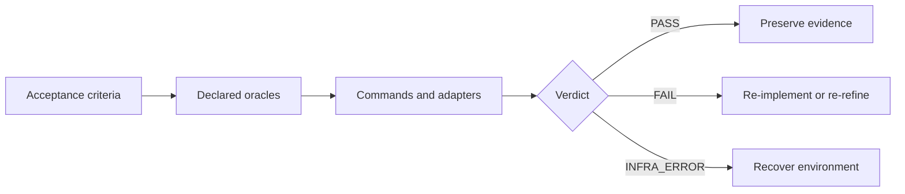

# @proofofwork-agency/dogfood

Dogfood is a final evidence gate for implemented work. You declare acceptance criteria, bind each deterministic criterion to an exact command or Playwright tag, and run one CLI that produces a portable proof bundle.



Dogfood does not replace your tests, architecture rules, build, or browser suite. It runs the tools you declare, checks what their evidence proves, and records the result. It never repairs product code or tests during a proof run.

## What PASS means

`PASS` means the declared contract validated, every required command passed, every deterministic criterion received its declared evidence, required Playwright tags ran successfully on their first attempt, and the configured mutation checks found no violation.

It does not mean undeclared requirements are correct. It does not turn a judgmental review into deterministic proof, cover Git-ignored files, or establish artifact provenance. `dogfood verify` checks a bundle's internal consistency; manifest v3 is unsigned and can be regenerated by an actor who can rewrite the bundle.

All deterministic criteria block regardless of `severity`. A missing oracle is a failure, never a skip. Warnings never change the verdict.

## Install

The package is private and not published to npm while v0.3 is validated. Install a reviewed Git revision:

```bash
npm install --save-dev github:proofofwork-agency/dogfood#<full-commit-sha>
npx dogfood version
```

For repository development, install dependencies in this checkout with `npm ci` and invoke `node bin/dogfood.mjs`.

## Five-minute setup

Initialize from the project you want to verify:

```bash
npx dogfood init
```

The starter contract intentionally cannot pass until you replace its placeholder. A minimal complete contract looks like this:

```yaml
version: 2
project: my-service

build:
  requireIdentity: true

commands:
  test:
    run: npm test
    timeoutMs: 120000
    adapter: exit-code

gates:
  verification: [test]

oracles:
  test-suite:
    kind: command
    command: test

acceptanceCriteria:
  - id: AC-tests
    text: The complete automated test suite passes.
    class: deterministic
    oracle: test-suite
    severity: blocker
```

Validate, run, inspect, and verify the resulting bundle:

```bash
npx dogfood validate
npx dogfood run
npx dogfood report
npx dogfood verify artifacts/dogfood/<run-id>
```

`validate` checks schema and mappings without executing proof commands. `run` executes a fresh proof. `report` prints the summary referenced by `artifacts/dogfood/latest.json`. `verify` rechecks a chosen bundle offline.

## Evidence model

| Oracle | Adapter | What it proves |
|---|---|---|
| `kind: command` | `exit-code` | The complete named shell command exited with code 0. |
| `kind: playwright` | `playwright-json` | Every execution with the exact `@dogfood:<criterion-id>` tag passed on its first attempt. |
| `kind: advisory` | none | A review receipt was recorded; it never changes the hard verdict. |

Use a Playwright oracle when the claim requires proof that one specific journey existed and ran. A broad browser command exiting 0 cannot prove that a grep or tag matched anything.

## Authoritative policy

`npx dogfood init --authoritative` also writes `.dogfood/dogfood.policy.yaml`. Pass it explicitly:

```bash
npx dogfood validate --policy .dogfood/dogfood.policy.yaml
npx dogfood run --policy .dogfood/dogfood.policy.yaml
```

Policies are never auto-discovered because silently enabling one could flip verdicts. When the default policy file exists but `--policy` is omitted, the run stays in the standard profile and records a warning.

The authoritative profile can require a criteria floor and named gates, block contract regression against `--baseline-ref`, inspect the whole Git root for tracked and non-ignored untracked changes, require a build subject, and control log redaction.

## CLI

| Command | Purpose |
|---|---|
| `dogfood init` | Install a starter contract, optional policy, CI template, and agent skills. |
| `dogfood validate` | Validate the contract, policy, baseline, and mappings without executing proof commands. |
| `dogfood run` | Execute a fresh proof and write an evidence bundle. |
| `dogfood verify` | Check a bundle's manifest, checksums, snapshots, and declared subject. |
| `dogfood report` | Print the latest executed-run summary. |
| `dogfood migrate` | Convert a version 1 contract to version 2. |
| `dogfood version` | Print the package version. |
| `dogfood help` | Print usage and exit codes. |

See the [complete CLI reference](docs/cli.md) for flags, discovery rules, environment variables, and exit codes.

## Documentation

- [Contract reference](docs/contract.md)
- [Authoritative policy](docs/policy.md)
- [Artifact bundles and verification](docs/artifacts.md)
- [Playwright evidence](docs/playwright.md)
- [Advisory receipts](docs/advisory.md)
- [Continuous integration](docs/ci.md)
- [Agent operation](docs/agents.md)
- [Runnable examples](docs/examples.md)

The contract is trusted executable code. Running a contract runs its shell commands without a sandbox. Review contracts and policies before execution.

## Development

```bash
npm test
npm run test:self
npm run test:playwright-fixture
```

The repository gates itself with `.dogfood/dogfood.contract.yaml`. See [CONTRIBUTING.md](CONTRIBUTING.md) for the full contributor workflow once that release document is present.

Licensed under Apache-2.0.
